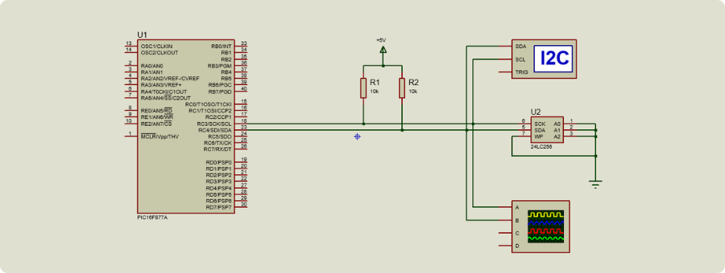
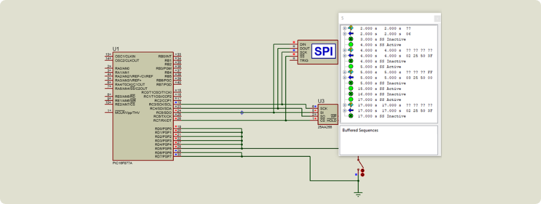
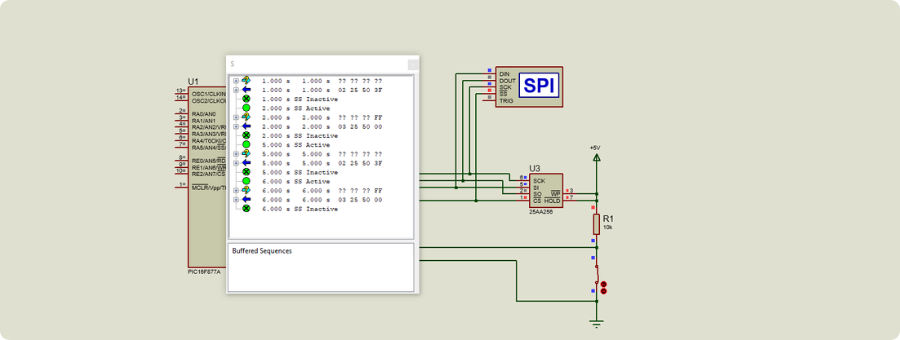

  

# Communication Protocols with PIC16F877A

This repository contains practical sessions (TPs) focused on implementing communication protocols using the PIC16F877A microcontroller. The goal is to understand how these protocols work and how to simulate and program them using MPLAB X and Proteus.

## Tools

- PIC16F877A
- MPLAB X IDE with XC8 Compiler
- Proteus 8
- I2C Debugger (Proteus)
- LCD 16x2 (optional)

## TP 1 - I2C Communication [• View](./TP1%20-%20I2C/)

This session covers the I2C protocol. We simulate communication between the PIC16F877A microcontroller and a 24LC256 EEPROM. An optional LCD can be used to display the received data.

## TP 2 - SPI Communication [• View](./TP2%20-%20SPI/)

This session covers the SPI protocol. We simulate communication between the PIC16F877A microcontroller and a 25AA256 EEPROM.

## Notes

- All simulations were created in Proteus 8.13.
- Code is written in C using the MPLAB X IDE and XC8 compiler.

## Related Repository

If you're new to working with the PIC16F877A, check out this repository for a basic introduction: [Getting Started with PIC16F877A](https://github.com/Choaib-ELMADI/getting-started-with-pic16f877a)
